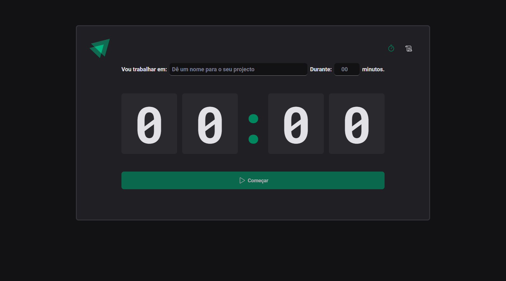

# Ignite Timmer 

Ignite Timer is nothing more than a project that allows the user to time their daily tasks, in addition to allowing them to see a history of all tasks already performed. developed during https://rocketseat.com.br react foundamental 02, to fixe content about, styled-components, react routers, form validation with zod and react hook form, state managment with reducer and context API.   

# 🛠️ Tecnologies
<li>Vite + React.js</li>
<li>Typescript</li>
<li>React Hook Forms</li>
<li>React Router Dom</li>
<li>Styled-components</li>
<li>Form validation with zod</li>
<li>Immer</li>

# 🚀 How to start ?
1- install node.js on your computer

>Clone repository
git clone https://github.com/usuario/nome-do-projeto.git

Browse to project folder
> cd project-name

Install dependencies
> npm install

Execute the project
> npm run dev

# 📚 Functional requirements
1 - Create New Cycle  
2 - Interrupt Created Cycles   
3 - Mark Cycles As Finished  
4 - View Created Cycles 

